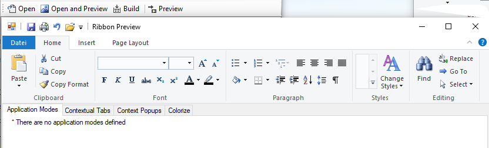

# WinForms-Ribbon for .NET8 and later

**RCW version** also available for **.NET Framework 4.6.2 and later**.

*Windows Ribbon Framework* for WinForms

**WinForms-Ribbon** is a .NET wrapper for *Microsoft Windows Ribbon Framework* library UIRibbon.dll. It will allow WinForms developers to use *Microsoft Windows Ribbon Framework* library in their WinForms applications.
Supported Windows versions are Windows 7 and later versions.

See also [Microsoft documentation](https://learn.microsoft.com/en-us/windows/win32/windowsribbon/-uiplat-windowsribbon-entry)

This project is a **REDESIGN** of the [WindowsRibbon](https://github.com/harborsiem/WindowsRibbon) project. It uses [Microsoft CsWin32](https://github.com/microsoft/CsWin32) for COM interfaces and all other native functions.
It also uses some internal classes and structs from Microsoft WinForms project on [Github](https://github.com/dotnet/winforms) for easier handling of COM interfaces.

## What's changed

- Namespace for all classes, structs, enums changed to **WinForms.Ribbon**
- Name of class Ribbon changed to RibbonStrip similar to ToolStrip, MenuStrip.
- Events changed from ExecuteEvent with much native stuff to specific event names and without natives.
- Some events added
- Invoke functions for events integrated. No Invoke functions for ItemsSourceReady, CategoriesReady 
- Easier persistence of Qat settings with new RibbonStrip property QatSettingsFile as an alternative.
- Two different, but functionally identical RibbonFramework libraries.
  1. One library has Com callable wrappers (CCW) for all COM interfaces for more performance. (Less Garbage collection, ...) 
  2. The other library has Runtime callable wrappers (RCW) for all COM interfaces. This is similar to WindowsRibbon.
- RibbonStrip property ResourceName changed to MarkupResource
- Some properties names changed (Properties with ...ID in the name changed to ...Id).
- Color functions changed.

- Samples for **C#** and **Visual Basic** adapted to the *RibbonFramework*.

## **Project Description**

The project includes the library RibbonFramework, which adds support for *Microsoft Windows Ribbon Framework* to WinForms application.

Read the Wiki Pages for more details on how to use the *RibbonFramework*.

Note: You must have Windows 7 SDK (or any later SDK) installed in order to compile (build) the project.
You also have to install C++ Tools in Visual Studio.

For easier designing, building and previewing the Windows Ribbon Framework there is a gui and console based tool called **RibbonTools64**

## Installation:

At the releases page of this project is a setup for **RibbonTools64**. Download **RibbonTools.zip**, unzip and install **RibbonTools.msi**.

for CCW RibbonFramework with name **RibbonFramework.CCW** available.
**.NET 8** and later supported.

for RCW RibbonFramework with name **RibbonFramework.RCW** available.
**.NET Framework 4.6.2** and later and **.NET 8** and later supported.

You can manage it for your project with the NuGet package manager in **Visual Studio 2022**.

## Samples

Following is the list of sample application and their description: 

- **01 - AddingRibbonSupport** - Empty WinForms application with basic Ribbon support.
- **02 - ApplicationMenuButton** - WinForms application with Ribbon that contains an application menu with some buttons.
- **03 - MenuDropDown** - WinForms application with DropDownButton and SplitButton inside an application menu.
- **04 - TabGroupHelp** - WinForms application that uses Tabs, Groups and HelpButton.
- **05 - Spinner** - WinForms application that demonstrates the use of a Spinner control in the ribbon.
- **06 - ComboBox** - WinForms application that demonstrates the use of a CombBox control in the ribbon.
- **07 - RibbonColor** - WinForms application that shows how to change the ribbon global colors.
- **08 - Images** - WinForms application that shows how to work set images dynamically in the ribbon.
- **09 - Galleries** - WinForms application thats uses DropDownGallery, SplitButtonGallery and InRibbonGallery.
- **10 - CheckBox** - WinForms application that uses CheckBox and ToggleButton control in the ribbon.
- **11 - DropDownColorPicker** - WinForms application that demonstrates the use of a DropDownColorPicker control in the ribbon.
- **12 - FontControl** - WinForms application that demonstrates the use of a FontControl control in the ribbon.
- **13 - ApplicationModes** - WinForms application that demonstrates the use of ApplicationModes.
- **14 - ContextualTabs** - WinForms application that demonstrates the use of ContextualTabs.
- **15 - ContextPopup** - WinForms application that demonstrates the use of ribbon context popups.
- **16 - RecentItems** - WinForms application that demonstrates the use of ribbon recent items.
- **17 - QuickAccessToolbar** WinForms application that demonstrates the use of quick access toolbar.
- **18 - SizeDefinition** WinForms application that demonstrates the use of custom layout templates.
- **19 - Localization** WinForms application that demonstrates how to localize your ribbon.
